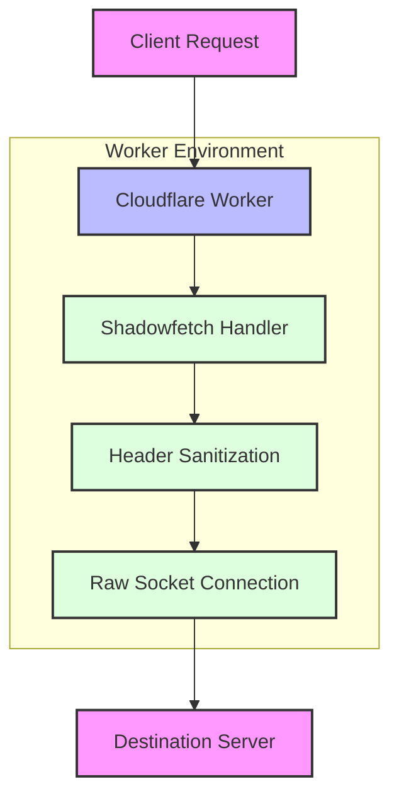

# Shadowfetch

[](https://www.gnu.org/licenses/agpl-3.0)

> A privacy-focused alternative to Cloudflare Workers' built-in fetch, licensed under the GNU Affero General Public License (AGPL).

## 📑 Table of Contents
- [Introduction](#introduction)
- [Why Shadowfetch?](#why-shadowfetch)
  - [About Cloudflare's Built-in fetch](#about-cloudflares-built-in-fetch)
  - [How Shadowfetch Protects Privacy](#how-shadowfetch-protects-privacy)
- [Installation & Usage](#installation--usage)
- [Architecture Overview](#architecture-overview)
- [Contributing](#contributing)
- [License](#license)

---

<a id="introduction"></a>
## 🌟 Introduction

Shadowfetch is an alternative to Cloudflare Workers' built-in `fetch`. It aims to maintain maximum control over request and response handling without leaking unnecessary user information. Since Cloudflare's built-in `fetch` may disclose details such as:
- User IP addresses
- Geolocation metadata (via CF-IPCountry)
- Other Worker-specific headers

…Shadowfetch acts as a privacy shield by stripping or selectively forwarding only the essential headers.

---

<a id="why-shadowfetch"></a>
## 🤔 Why Shadowfetch?

<a id="about-cloudflares-built-in-fetch"></a>
### About Cloudflare's Built-in fetch

When you use Cloudflare Workers, any outbound request through the default `fetch` can carry additional headers like:
- `cf-ipcountry`: Provides the user's country information.
- Various `cf-*` metadata: Used internally by Cloudflare for routing and analytics.

For many privacy-conscious scenarios—especially in user-centric applications—this can be problematic since end-users may not be aware that their location or IP-based data could be revealed.

<a id="how-shadowfetch-protects-privacy"></a>
### How Shadowfetch Protects Privacy

Shadowfetch works by:
1. Removing or masking all sensitive headers that Cloudflare automatically appends (e.g., `cf-ipcountry`, `cf-connecting-ip`).
2. Directly handling the request via raw TCP sockets (Cloudflare Workers allow experimental support for raw socket connections), bypassing most default Worker-level request enhancements.
3. Guaranteeing a minimal footprint—relaying only the essential information explicitly allowed to be shared with the target server.

By doing so, it reduces potential data leaks and offers a more transparent, privacy-oriented approach to proxying or forwarding requests.

---

<a id="installation--usage"></a>
## 📦 Installation & Usage

1. **Clone or download** this repository.
2. **Add or replace** your existing Worker's code with Shadowfetch's main script.
3. **Configure** your personal settings (like `AUTH_TOKEN`, `DEFAULT_DST_URL`, etc.) in the code:
   ```js
   const CONFIG = {
     AUTH_TOKEN: "image",             // Example usage
     DEFAULT_DST_URL: "https://...",  
     DEBUG_MODE: false,
   };
   ```
4. **Deploy** your Worker to Cloudflare via Wrangler or the Cloudflare dashboard.

When your Worker receives HTTP or WebSocket requests under the specific path pattern (e.g., `/image/https/...`), Shadowfetch will route them through a raw socket-based approach—thus mitigating metadata exposure.

---

<a id="architecture-overview"></a>
## 🏗️ Architecture Overview



**Key Components:**
1. 🔄 **Request Interception:** The client's request is intercepted by your Cloudflare Worker.
2. 🧹 **Header Processing:** Shadowfetch strips sensitive headers and metadata.
3. 🔌 **Raw Socket Connection:** Direct TCP connection bypasses Cloudflare's built-in header injections.
4. 📨 **Clean Delivery:** The target server receives only essential, privacy-respecting data.

---

<a id="contributing"></a>
## 👥 Contributing

Contributions are welcome! Please fork the repository, create a new branch, and open a pull request with your changes or improvements.

Some ways to contribute:
- 💡 Suggesting new features.
- 🐛 Reporting bugs.
- 📝 Writing documentation and examples.

---

<a id="license"></a>
## ⚖️ License

Shadowfetch is licensed under the [GNU Affero General Public License](https://www.gnu.org/licenses/agpl-3.0.html) (AGPL).  
You are free to use, distribute, and modify the project under the terms of the AGPL.
